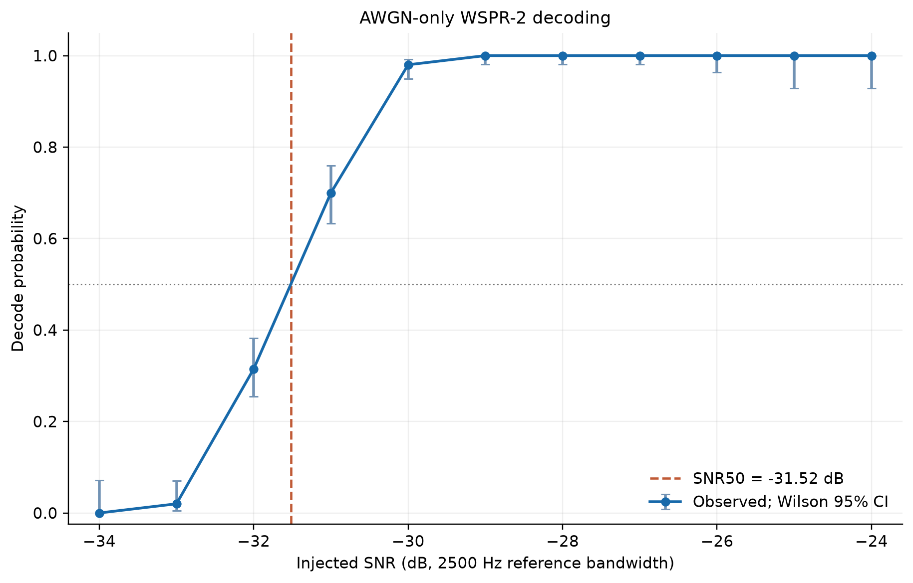
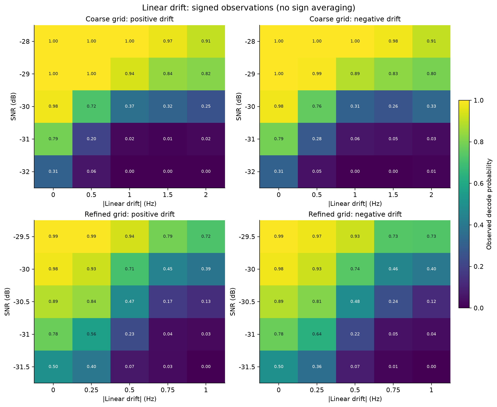
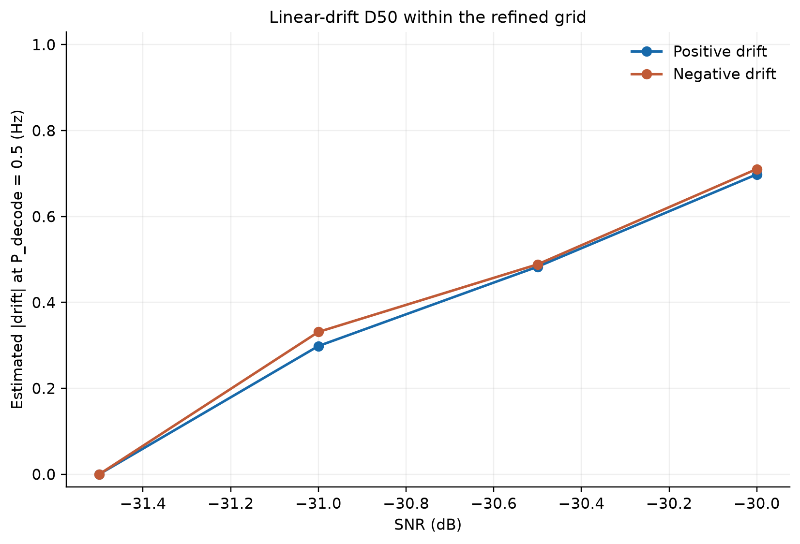
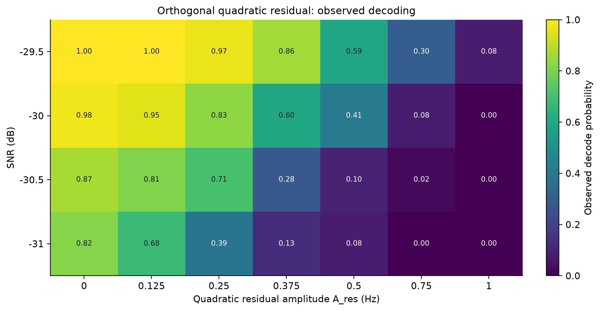
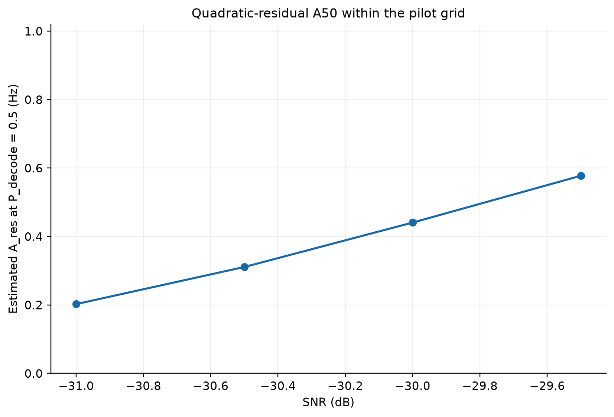
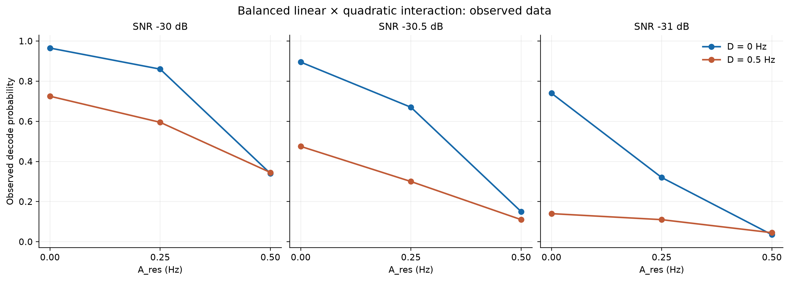
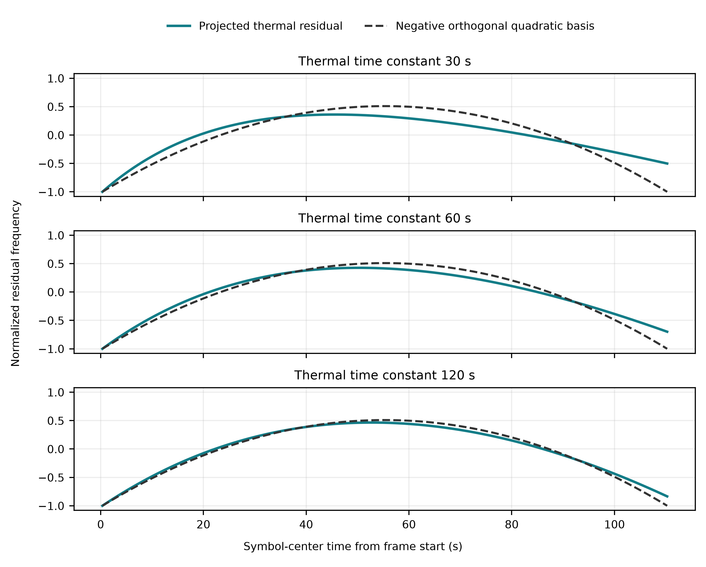
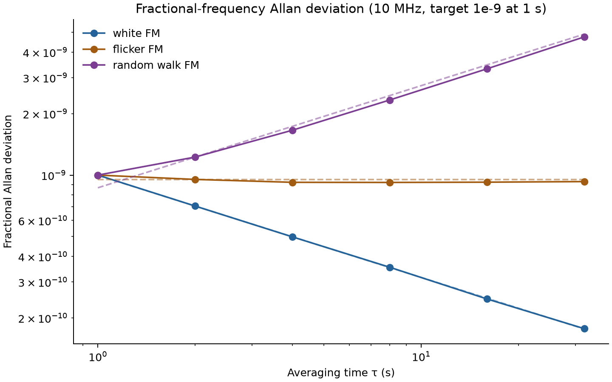
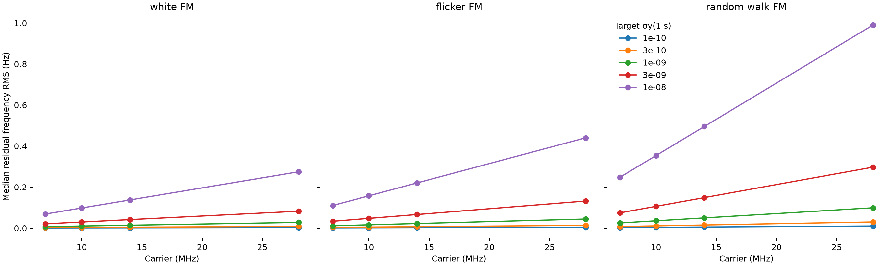
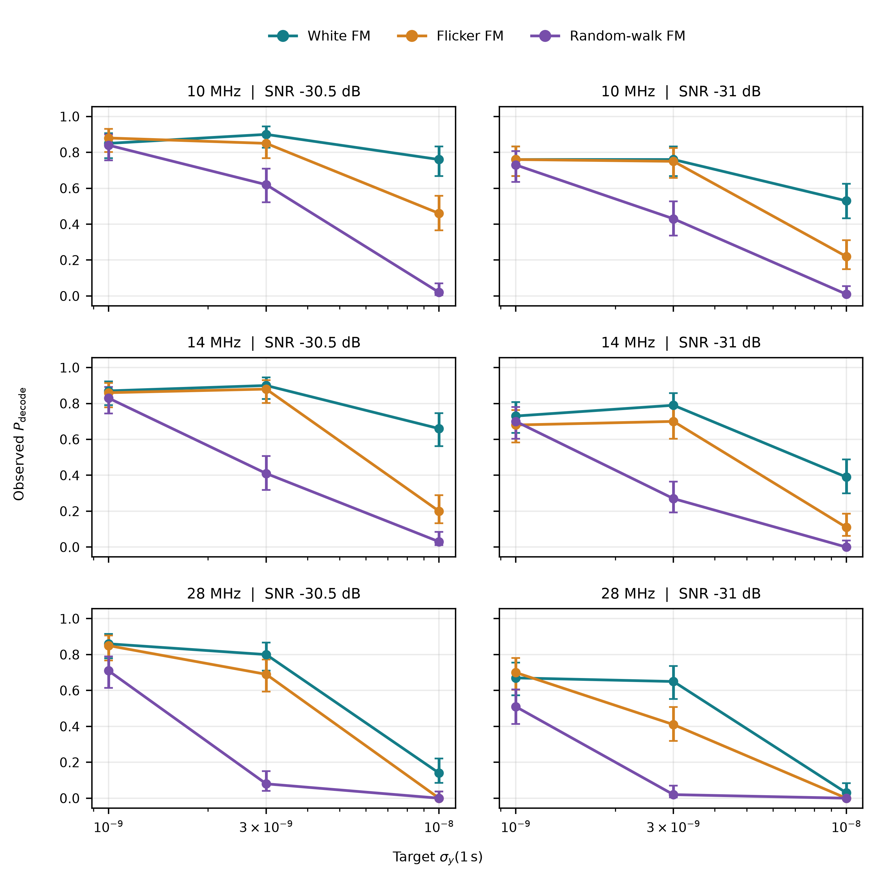

# Beyond First-Order Drift: Practical WSPR-2 Decoding Robustness under Nonstationary Frequency Instability

## Abstract

Frequency error in a weak-signal transmission has components that a receiver may search explicitly and components outside its trajectory model. We measured this distinction for a generated WSPR-2 signal decoded by the unmodified production WSJT-X 3.0.2 `wsprd`. The independent waveform implementation matched all 162 reference channel symbols; complex additive white Gaussian noise (AWGN) was calibrated to the 2500-Hz WSPR SNR convention. The AWGN-only 50% decode point was −31.519 dB by interpolation. Exact decoder-aligned linear drift, an orthogonal quadratic residual, thermal-settling shape probes, and stochastic frequency-modulation (FM) families were evaluated on saved, seeded trial grids. Signed linear-drift 50% boundaries contracted from +0.6981/−0.7105 Hz at −30.0 dB to +0.2985/−0.3313 Hz at −31.0 dB. The corresponding orthogonal-quadratic 50% amplitude decreased from 0.4408 to 0.2026 Hz. A balanced factorial fit measured a linear-drift × residual interaction coefficient of 10.1555 log-odds/Hz² on its fitted scale. Among tested scalar trajectory descriptors, maximum phase excursion improved smooth-shape held-out scores, whereas residual-frequency RMS scored better on the separate held-out random-walk set. A further 5,400-trial sweep of synthetic Allan-targeted FM processes related fractional-frequency stability, carrier scaling, projected residuals, and decode outcomes. The results characterize this decoder and these generated waveforms and grids; no transmitter hardware, measured oscillator, or propagation impairment was tested.

**Index terms—** WSPR-2, weak-signal decoding, frequency drift, oscillator frequency noise, Allan deviation, model mismatch.

## I. Introduction

WSPR-2 combines long symbol duration with low-rate coding for reception at weak signal-to-noise ratio (SNR). The original WSPR account describes its narrow four-tone signal and propagation-beacon purpose [4], and the current official guide documents its protocol and 2500-Hz SNR reference [2]. Frequency variation across the active frame can be represented by a center-frequency offset, a linear drift, or more complex time dependence. Those categories matter because the tested production decoder searches constant frequency and a linear symbol-index drift [1], while an imposed residual orthogonal to both remains outside that search trajectory class.

Related work addresses different observables. A transmitter study measured WSPR-2 spectral width and examined reference stability and frequency-generation choices [5]. FST4W work used reported spectral spread and SNR to distinguish propagation modes [6]; the WSJT-X guide discusses frequency instability and channel Doppler spread for FST4/FST4W [2]. Frequency-metrology methods characterize fractional-frequency noise and Allan-deviation slopes [3], while WSPRNet reports have been used in studies of HF propagation response to solar activity [7]. None of those sources supplies a decode-probability map for the exact generated trajectories and production decoder tested here. Conversely, this study does not measure transmitter width, Doppler spread, oscillator hardware, or field propagation.

The investigation proceeds from an AWGN-only baseline to decoder-aligned drift, controlled quadratic residual curvature, joint conditions, projected thermal and stochastic shapes, and synthetic Allan-targeted FM processes. It reports a decoder-specific map of observed decode probabilities and compares simple residual-severity descriptors over the tested families. It does not set a general WSPR frequency-stability requirement.

## II. WSPR-2 Decoder and Experimental Framework

### A. WSPR-2 waveform and production decoder

All decoder outcomes use the unmodified production `wsprd` from WSJT-X 3.0.2, with release package and matching source provenance recorded in the repository [1]. The generated WSPR-2 active frame contains 162 symbols, 256 complex samples per symbol at 375 samples/s, and therefore lasts 110.592 s. The C2 input contains the required timing padding. The decoder source searches center frequency and a symbol-index linear drift; this is a property of this implementation, not an assertion about all WSPR receivers. The decoded Type-1 message in these tests is `K1ABC FN42 33`.

### B. Independent waveform validation

The Python encoder's 162 channel symbols matched the official WSJT-X `wsprsim` reference vector at all 162 positions. Its generated clean C2 signal was decoded by production `wsprd` as `K1ABC FN42 33`. The reference, source archive identity, and clean decode check are documented in the saved [waveform validation](../docs/python-generator-validation.md) and [reference record](../docs/wspr-reference.md). This gate checks experimental input compatibility; it does not itself establish noisy-channel performance.

### C. AWGN calibration and decode-success criterion

The repository defines injected SNR in a 2500-Hz reference bandwidth [2]. For active complex-signal power `P_s`, complex noise power at the 375-Hz C2 sample rate is

```text
P_n = P_s (375/2500) 10^(−SNR_2500,dB/10),
Var(n_I) = Var(n_Q) = P_n/2.
```

Independent Gaussian in-phase and quadrature components were applied with deterministic seeds. The `375/2500` factor corresponds to 8.239 dB between the two bandwidth conventions, compared with the official simulator's rounded 8.2-dB adjustment. The [calibration record](../docs/awgn-calibration.md) gives the source-derived derivation and direct checks. For a condition with `N` trials, `P_decode` is the number of exact decodes of `K1ABC FN42 33` divided by `N`; a partial or different message is not a success. Binomial cell intervals in saved summaries are Wilson 95% intervals. `wsprd`-reported SNR is retained as a diagnostic estimate rather than substituted for injected SNR.

### D. Frequency-trajectory decomposition

At symbol index `i = 0,…,161`, define `x_i=(i−81)/81` and `X=[1,x]`. A symbol-rate frequency trajectory can be decomposed as

```text
Δf_i = c_0 + c_1 x_i + r_i,
[c_0,c_1]^T = argmin_b ||Δf − Xb||²,
X^T r ≈ 0.
```

Here the fitted constant-plus-linear component is decoder-representable in form; the projected residual is a controlled beyond-linear component. Symbol-wise frequency offsets are held for the 256 samples of each symbol and applied by continuous phase accumulation. Phase descriptors use the same 375-Hz sample timing; they are calculated from the residual trajectory, not from the unprojected raw process. Orthogonality refers to the discrete 162-symbol `[1,x]` basis, within floating-point precision.

### E. Statistical methodology

Saved experiments use stated condition grids and deterministic seeds. Where comparisons were designed with matched noise, the same seed set was reused across trajectory conditions at a fixed SNR. Trial-level outcomes, summary arithmetic, row counts, and seed-set checks are documented with the respective outputs. SNR50, signed D50, and A50 values are piecewise-linear interpolations between observed probability points; they are not extrapolated beyond the measured grid. The balanced interaction analysis fits additive (M0) and drift × residual (M1) logistic models and reports ordinary and cluster-robust uncertainty, plus cluster bootstrap. Descriptor models are evaluated on held-out trajectory families and on later external sets; their reported Brier and log losses are predictive scores for the specified splits.

## III. Robustness Within the Decoder Model Class

### A. Exact first-order drift model

The decoder-aligned trajectory is

```text
Δf_i = (D/2) x_i = (D/2)(i−81)/81,  i=0,…,161.
```

It matches the source-inspected `wsprd` drift convention [1]. The endpoint at `i=161` is slightly below `+D/2`; the implementation uses the exact expression rather than a sample-wise endpoint-to-endpoint substitute. Positive and negative drift conditions remain separate in the raw results.

### B. Noiseless and high-SNR controls

Strict noiseless controls at `D=0,±1,±2,±3,±4` Hz decoded the expected message in each one-trial condition. At injected −20 dB, all nine corresponding conditions decoded 20/20 trials. These controls show that the waveform and exact drift implementation can be decoded across that tested grid with ample SNR. The same strict-control records show 141/200 at zero drift, 8/200 at +2 Hz, and 7/200 at −2 Hz at −31 dB. These finite-sample observations do not imply an invariant drift tolerance.

### C. SNR-dependent linear-drift boundary

The AWGN-only baseline had interpolated SNR90, SNR50, and SNR10 values of −30.286, −31.519, and −32.729 dB, respectively ([Table I](tables/table_i_awgn.md), Fig. 1). Across 1,201 successful decodes with reported SNR, the mean reported-minus-injected difference was +0.111 dB and the median was 0.0 dB.

The refined signed-drift map used 200 trials per SNR × drift cell. Interpolated positive/negative D50 values were +0.6981/−0.7105 Hz at −30.0 dB, +0.4831/−0.4886 Hz at −30.5 dB, and +0.2985/−0.3313 Hz at −31.0 dB ([Table II](tables/table_ii_boundaries.md), Fig. 2). At −29.5 dB the tested drift values did not bracket 50%, so no D50 is assigned there. At −31.5 dB the reported zero-drift D50 is a boundary observation where the zero-drift cell is at 50%; it is not a measured nonzero drift allowance. Figure 2 retains the underlying signed measurements even where a magnitude-based display is used.



*Fig. 1. AWGN-only production-`wsprd` decode probability versus injected 2500-Hz-reference SNR. Thresholds are interpolated from observed points.*





*Fig. 2. (a) Coarse/refined linear-drift probability maps with positive and negative conditions in separate panels and no sign averaging; (b) signed, grid-interpolated D50 boundary.*

## IV. Beyond First-Order Frequency Dynamics

### A. Orthogonal quadratic residual construction

To test model mismatch without adding a hidden constant or linear term, set `q=x²`, compute `β=argmin_b ||q−Xb||²`, and form

```text
q_⊥ = q − Xβ,       q_norm = q_⊥ / max_i |q_⊥,i|,
r_i = A_res q_norm,i.
```

No coefficient is hard-coded. At `A_res=1` Hz, saved discrete dot products of `r` with the constant and `x` columns were −1.710×10⁻¹⁴ and 4.441×10⁻¹⁶ Hz, respectively. This is an orthogonal test shape, not a physical oscillator model. The pilot held nominal drift at zero.

### B. Decode-probability boundary

The quadratic pilot used 100 trials per tested SNR × amplitude cell. Its bracketed A50 estimates were 0.5776, 0.4408, 0.3110, and 0.2026 Hz at −29.5, −30.0, −30.5, and −31.0 dB, respectively ([Table II](tables/table_ii_boundaries.md), Fig. 3). They measure the amplitude of this normalized residual basis at the 50% crossing, not a threshold for arbitrary trajectory shapes.





*Fig. 3. (a) Orthogonal-quadratic residual probability map and (b) observed-grid A50 boundary.*

### C. Linear × quadratic non-additivity

The balanced factorial set tested SNR −30.0/−30.5/−31.0 dB, `D=0/0.5` Hz, and `A_res=0/0.25/0.5` Hz, with 200 trials in each of 18 cells (3,600 trials). Within each SNR the six conditions shared matched noise seeds. M1 added `D × A_res` to the SNR, D, and A main effects. Its fitted interaction coefficient was 10.1555 log-odds/Hz² (ordinary SE 0.9125; cluster-robust SE 0.8389; 1,000-fit cluster-bootstrap 95% interval [8.5377, 11.9454]). M0 versus M1 AIC was 3534.398 versus 3405.319, BIC 3559.153 versus 3436.263, and in-sample Brier 0.160689 versus 0.153797 ([Table III](tables/table_iii_interaction.md), Fig. 4). This is non-additivity on the fitted log-odds scale over the tested grid; the fit alone does not identify a decoder mechanism.



*Fig. 4. Observed balanced-factorial decode probabilities by residual amplitude, SNR, and exact linear drift.*

## V. Physically Motivated Frequency-Instability Models

### A. Thermal-settling residuals

A deterministic shape probe evaluates `f_raw(t)=K[1−exp(−t/τ)]` at the 162 symbol-center times and removes its least-squares `[1,x]` component. For `K=1` Hz, residual peak amplitudes `g_τ=max|r|` are 0.322981, 0.141356, and 0.048772 Hz for `τ=30,60,120` s. Their normalized correlations with the *negative* quadratic residual are 0.956853, 0.988241, and 0.996991. These time constants were selected as shape probes, not inferred from measured hardware. Amplitude-matched thermal and signed-quadratic trials used matched noise seeds. At −30 dB and 0.5-Hz peak residual, observed thermal decode probabilities were 0.68, 0.50, and 0.46 for τ 30, 60, and 120 s; the signed-quadratic controls were 0.35 for positive and 0.36 for negative amplitude. Shape correlation alone therefore does not specify equal measured decode probability in these cells (Fig. 5).



*Fig. 5. Projected and normalized thermal-settling residual shapes for the tested τ values, compared with the negative controlled quadratic basis; the thermal parameters are illustrative.*

### B. Stochastic random-walk FM

A separate, uncalibrated symbol-rate probe starts at `f_raw,0=0` and takes Gaussian increments `f_raw,i=f_raw,i−1+ε_i`, with `ε_i∼N(0,σ_step²)`, before `[1,x]` projection. Preflight medians of projected RMS frequency were 0.01510, 0.02993, 0.06002, 0.12067, and 0.23888 Hz for `σ_step=0.005,0.01,0.02,0.04,0.08` Hz. Decoder tests used the latter four levels, 200 trials per cell. At SNR −30.0 dB, observed probabilities were 0.935/0.945/0.815/0.345 in ascending `σ_step`; at −30.5 dB, 0.885/0.795/0.675/0.175; and at −31.0 dB, 0.745/0.620/0.355/0.035. This random walk is a stochastic trajectory probe and has no measured oscillator calibration.

### C. Allan-deviation-parameterized white/flicker/random-walk FM

The later synthetic FM preflight generated 1-s-cadence fractional-frequency processes `y(t)` of white, flicker, and random-walk type, scaled to ensemble targets of `σ_y(1 s)=10⁻¹⁰,3×10⁻¹⁰,10⁻⁹,3×10⁻⁹,10⁻⁸` over carriers 7/10/14/28 MHz. It used 500 independent trajectories per family × carrier × stability cell. The process was sampled by zero-order hold at validated WSPR symbol centers, mapped through `Δf=f_c y`, and projected off `[1,x]`. The preflight's fitted raw Allan-deviation slopes were −0.5026, −0.0279, and +0.4387 for white, flicker, and random-walk FM; the corresponding projected slopes were −0.4344, +0.0116, and +0.4367. These satisfy the configured ±0.18 qualitative-slope check against −1/2, 0, and +1/2, respectively [3] (Fig. 6). They are finite-cadence synthetic generators and not traceable metrology references.

### D. Carrier-frequency scaling

The production-decoder physical-parameter sweep selected carriers 10/14/28 MHz, targets `σ_y(1 s)=10⁻⁹,3×10⁻⁹,10⁻⁸`, and SNR −30.5/−31.0 dB, with 100 trials in each of 54 cells (5,400 trials). The oscillator trajectory was reused across the two SNR values and AWGN seeds matched across physical cells within an SNR. At 10 MHz, target `10⁻⁸`, and −31 dB, median projected frequency RMS was 0.09746/0.15570/0.34478 Hz for white/flicker/random-walk FM, with observed `P_decode=0.53/0.22/0.01`. For random-walk FM at target `3×10⁻⁹` and −31 dB, the 10/14/28-MHz cells had median RMS 0.11282/0.14218/0.27776 Hz and probabilities 0.43/0.27/0.02 ([Table IV](tables/table_iv_physical.md), Fig. 7). These are cell estimates under synthetic processes; the carrier variable is the fractional-to-hertz scaling parameter, not a comparison of measured transmitters.





*Fig. 6. (a) Synthetic FM Allan-deviation slopes and (b) projected residual-frequency RMS versus carrier-scaling parameter.*



*Fig. 7. Observed production-`wsprd` decode probabilities for the saved 54-cell physical-parameter sweep. Rows are carrier-scaling frequencies; columns are injected SNRs. Points denote 100-trial cell proportions and bars are Wilson 95% intervals.*

## VI. Cross-Trajectory Severity Descriptors

### A. Peak residual frequency

The AMP candidate uses the largest absolute value of the projected residual frequency. It is easy to compute, but equal peaks can arise from different time histories. Its evaluation used the same held-out trials as the other scalar candidates within each comparison ([Table V](tables/table_v_descriptors.md)).

### B. Maximum residual phase excursion

The residual phase is the continuous accumulation of projected frequency, `φ[n+1]=φ[n]+2πr_f[n]/375`, with each symbol offset held across its 256 samples. PHASE augments AMP with `max_n|φ[n]|`. In five-family leave-one-family-out tests over smooth deterministic quadratic-positive, quadratic-negative, and three thermal shapes (3,000 held-out trial predictions), PHASE achieved Brier 0.167685 and log loss 0.505995, compared with AMP 0.173669 and 0.522790. The paired AMP-minus-PHASE Brier difference was +0.005984, with a cluster-bootstrap 95% interval [+0.003534,+0.008470].

### C. Residual-frequency RMS

RMS uses `[162⁻¹ Σ_i r_i²]^{1/2}` after projection. The separately evaluated SNR-plus-RMS model scored Brier 0.168073 and log loss 0.507057 in smooth-family holdouts. None of AMP, PHASE, or RMS describes the entire temporal trajectory; differences among amplitude-matched thermal and quadratic cells illustrate this limitation.

### D. Held-out and external validation

On the independent 2,400-trial symbol-rate random-walk set, frozen AMP/PHASE/RMS models scored Brier 0.147956/0.161398/0.145333 and log loss 0.466755/0.501690/0.457456 ([Table V](tables/table_v_descriptors.md)). Thus PHASE's improvement over AMP in the tested smooth-shape holdouts did not persist on that random-walk set, while RMS had the lowest score among these three tested scalars there. On a further 5,400 new synthetic Allan-targeted physical-sweep trials, the frozen SNR-plus-RMS model scored Brier 0.143960 and log loss 0.441462; those outcomes were not used to refit it. The external score is tied to this sweep's outcome prevalence and support.

### E. Remaining morphology dependence

The six-family RMS support audit found that 1,467 of 2,400 held-out random-walk rows were outside the training families' RMS support. A diagnostic all-data fit with family terms had AIC 5178.173 versus 5177.862 without them, BIC 5230.926 versus 5197.644, and Brier 0.156226 versus 0.156575. That fit is descriptive rather than a deployable predictor. Family-specific residual errors and out-of-support predictions remain, so a single RMS coordinate is not sufficient to establish trajectory-independent calibration.

## VII. Engineering Implications

For this production decoder and generated-signal test bed, frequency-stability assessment can be organized as `fractional frequency y(t) → absolute deviation f_c y(t) → [1,x] projection → residual descriptor → observed decode probability`. This sequence distinguishes a constant or linear component the decoder searches from residual motion it does not explicitly represent. The saved carrier-scaling audit records higher projected hertz severity at higher `f_c` for comparable fractional targets, while the physical-sweep cells show that FM family and injected SNR also change observed probabilities. Accordingly, a specification expressed solely as total drift, peak offset, or Allan deviation at one averaging time would not reproduce the tested cell outcomes without the process shape, carrier scaling, and decoder configuration. No procurement threshold or field-link performance guarantee is derived here.

## VIII. Limitations

Every decode probability belongs to the unmodified production WSJT-X 3.0.2 `wsprd`, the fixed generated message/waveform, the repository's C2 path and AWGN convention, and a finite tested grid. The decoder's acquisition and candidate-search behavior is part of the outcome; an ideal receiver was not evaluated. D50 and A50 are interpolated within observed brackets and inherit Monte Carlo uncertainty. The strict noiseless controls have only one trial per drift value, and finite 100- or 200-trial cells should not be treated as exact probabilities.

No RF hardware, oscillator trace, field propagation, Doppler, or nonstationary multipath was measured or simulated in these reported sweeps. The thermal time constants and uncalibrated random-walk steps are shape probes. The Allan-targeted synthetic processes have finite sample cadence and spectral support and are scaled to an ensemble 1-s statistic; qualitative slope agreement does not make them traceable frequency standards or measurements of a particular oscillator. The physical sweep's carrier labels change `Δf=f_c y`, not the C2 dial frequency. Matched seeds reduce comparison noise but do not turn a shared noise realization into independent replications. Smooth-family holdouts reuse a small set of deterministic shapes, and the descriptor models exhibit support and morphology dependence.

## IX. Conclusion

Saved decoder trials show separate SNR-dependent responses to exact in-model linear drift and to projected beyond-linear frequency residuals. The controlled quadratic grid provided bracketed A50 estimates, while the balanced factorial yielded a nonzero fitted drift × residual term on the log-odds scale. Thermal, random-walk, and synthetic Allan-targeted FM tests broadened the tested trajectory set without establishing measured-hardware behavior. Across these saved comparisons, no tested scalar residual descriptor was sufficient to remove all family and support effects. The reported boundaries and scores are therefore empirical properties of the specified production decoder, generated waveform, and condition grids.

## References

[1] WSJT Development Group, [*WSJT-X 3.0.2*](https://github.com/WSJTX/wsjtx/releases/tag/v3.0.2), 2026.

[2] WSJT Development Group, [*WSJT-X User Guide*](https://wsjtx.github.io/wsjtx/guide-full.html), living, undated official documentation.

[3] W. J. Riley, [*Handbook of Frequency Stability Analysis*](https://doi.org/10.6028/NIST.SP.1065), NIST Special Publication 1065, 2008.

[4] J. Taylor and B. Walker, [“WSPRing Around the World”](https://wsjt.sourceforge.io/WSPR_QST_Nov_2010.pdf), *QST*, November 2010.

[5] R. B. Johnson and G. Marcus, [“How Narrow is Narrow Enough? An Investigation of WSPR-2 Spectral Width”](https://www.researchgate.net/publication/400563668_How_Narrow_is_Narrow_Enough_An_Investigation_of_WSPR-2_Spectral_Width), *The LongPath*, vol. 50, no. 1, pp. 10–12, January 2026.

[6] G. Griffiths, [“Identifying 14 MHz Propagation Modes Using FST4W SNR and Spectral Spread”](https://hamsci.org/publications/2023/identifying-14-mhz-propagation-modes-using-fst4w-snr-and-spectral-spread), *HamSCI Workshop 2023*, March 2023.

[7] N. A. Frissell *et al.*, [“High-Frequency Communications Response to Solar Activity in September 2017 as Observed by Amateur Radio Networks”](https://doi.org/10.1029/2018SW002008), *Space Weather*, vol. 17, no. 1, pp. 118–132, 2019.

Complete metadata, source status, and claim mapping are in [references_notes.md](references_notes.md); BibTeX is in [references.bib](references.bib).
